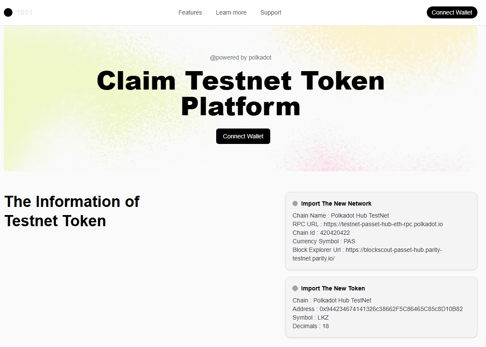
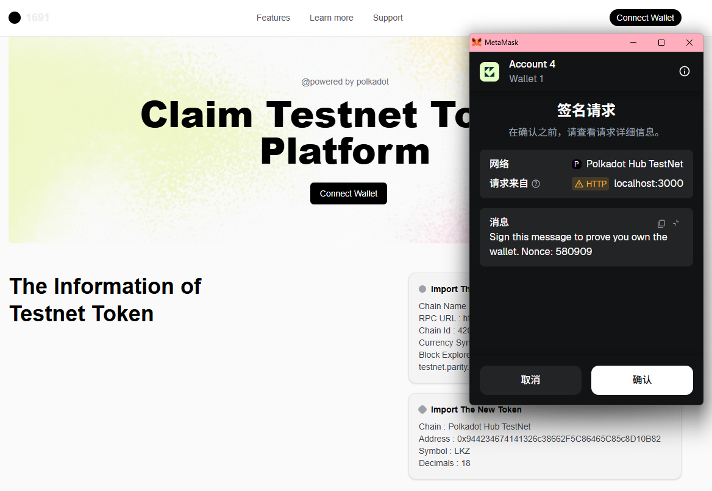
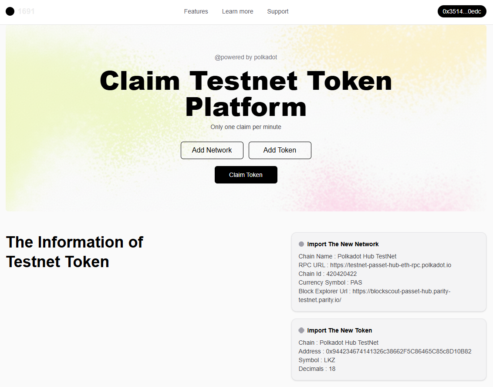

# Lesson3 笔记
整体的目录
```.
├── hardhat-test/   # 编写与部署 MintableERC20 合约
├── my-app/         # 前端调用 MintableERC20，并与 MetaMask 交互
├── ts-ethers/      # 基于 ethers 的读写练习
└── ts-viem/        # 基于 viem 的读写练习
```

## Lesson3 的 DApp展示
前端效果-初始


前端效果-连接钱包后



接下来的点击效果就自行fork试试，经过多次测试在本地跑是没问题的（WSL2）

## Lesson3 的 DApp实现
运行环境：**WSL2**

在hardhat中编写MintableERC20合约，并且进行简单的测试，随后在`1691\hardhat-test\ignition\modules`里构建一个`MintableERC20.ts`，只需要修改`name`和`symbol`参数即可

代码如下：
```ts
import { buildModule } from "@nomicfoundation/hardhat-ignition/modules";

// Deploys MintableERC20 with configurable name, symbol and mint interval (seconds)
export default buildModule("MintableERC20Module", (m) => {
  const name = m.getParameter("name", "LKZToken");
  const symbol = m.getParameter("symbol", "LKZ");
  const interval = m.getParameter("interval", 60n); // 1 minute

  const token = m.contract("MintableERC20", [name, symbol]);

  // Deployer is owner; set custom interval if desired
  m.call(token, "setInterval", [interval]);

  return { token };
});
```


随后在`1691\hardhat-test\hardhat.config.ts`文件中添加`polkadotHubTestnet`的信息:
```ts
import type { HardhatUserConfig } from "hardhat/config";
import hardhatToolboxMochaEthersPlugin from "@nomicfoundation/hardhat-toolbox-mocha-ethers";
import { configVariable } from "hardhat/config";

const config: HardhatUserConfig = {
  plugins: [hardhatToolboxMochaEthersPlugin],
  solidity: {
    ...
  },
  networks: {

    ...
    polkadotHubTestnet: {
      type: "http",
      url: 'https://testnet-passet-hub-eth-rpc.polkadot.io',
      accounts: [configVariable('POLKADOT_PRIVATE_KEY')],
    },
  },
};

export default config;
```


在Metamask上开一个账户，并且复制私钥，随后输入以下命令。输入命令后应该需要你设置password（至少8个字符），当看到有production keystore的字眼后，将复制好的私钥粘贴到命令行后enter即可
```wsl
npx hardhat keystore set POLKADOT_PRIVATE_KEY
```

随后执行以下命令行，选择yes，之后会显示成功部署并且会输出合约地址（如果不能部署，尝试删掉`1691\hardhat-test\ignition\deployments`）
```wsl
npx hardhat ignition deploy ./ignition/modules/MintableERC20.ts --network polkadotHubTestnet
```

如果你想看这个合约是否真的部署到了测试网，可以到Polkadot的测试网区块浏览器查看 https://blockscout-passet-hub.parity-testnet.parity.io/ 。只需要复制合约地址到搜索框粘贴即可。


接下来进入 `1691\my-app`

打开 `1691\my-app\src\types\wallet.ts` 并将复制的合约地址粘贴在 `CONTRACT_ADDRESS` ，随后到 `1691\hardhat-test\artifacts\contracts\MintableERC20.sol\MintableERC20.json` 里找出 `abi` ，并将它复制到 `wallet.ts` 的 `ABI`
```typescript
export const ABI = [
    ...
];

export const CONTRACT_ADDRESS = "0x9442...0B82";
```

打开 `1691\my-app\src\components\wallet.tsx` 修改 `TOKEN_PARAMS`参数，将合约地址、代币符号与之前部署的相同即可
```typescript
const TOKEN_PARAMS = {
    type: 'ERC20',
    options: {
        address: '0x9442...0B82', // 替换为你的代币合约地址
        symbol: 'LKZ', // 代币符号
        decimals: 18, // 代币小数位
    },
} as const;
```

最后启动项目
```wsl
npm install
npm run dev
```

## Lesson3 DApp的功能
`connectWallet`：连接Metamask钱包，每次连接都必须要求用户进行签名，确保不会恶意伪造身份（签名的部分在`1691\my-app\src\api\wallet_routes.js`）

`checkNetwork`：检查是否已连接钱包

`addNetwork`：为Metamask钱包添加测试网络；如果已完成设置网络，则不会响应

`addToken`：为Metamask钱包添加在该网络下的代币信息

`mintToken`：用户每分钟都可以mint到1个代币

`disconnectWallet`：断开连接