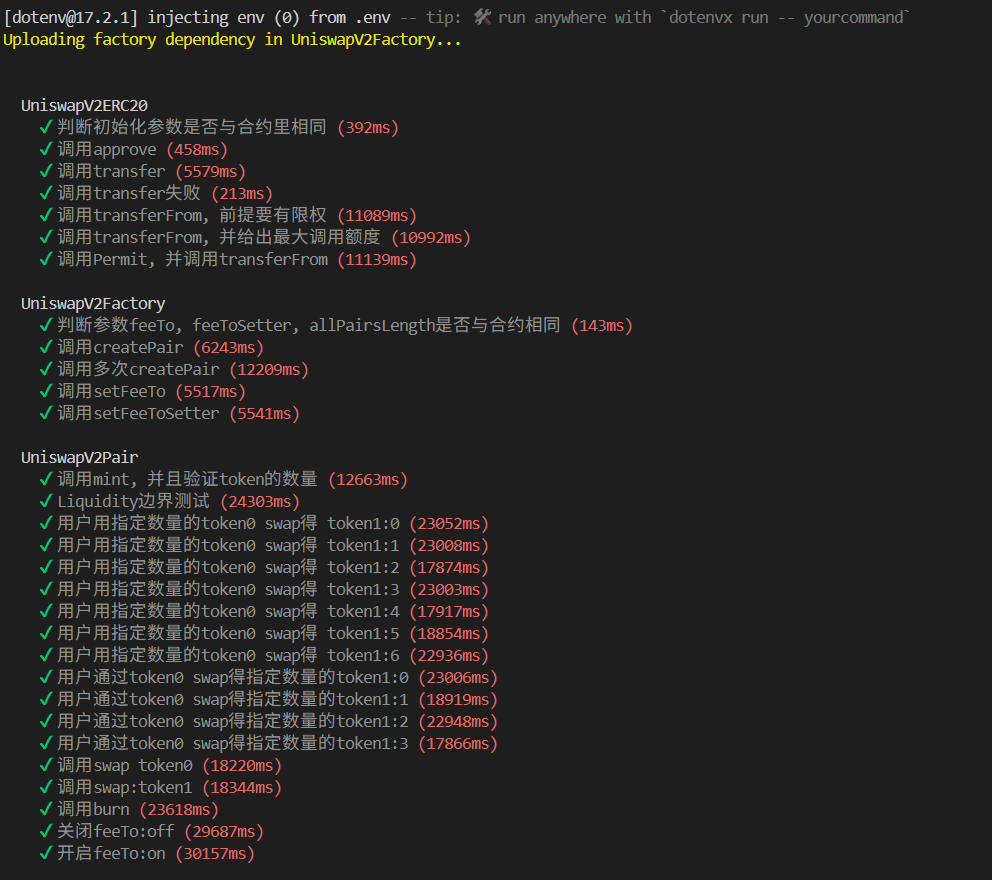

# Uniswap V2 - Polkadot Hub

## Prerequisites

Ensure that you have substrate-node, eth-rpc and local resolc binaries on your local machine. If not, follow these instructions to install them:

```bash
git clone https://github.com/paritytech/polkadot-sdk
cd polkadot-sdk
git checkout c40b36c3a7c208f9a6837b80812473af3d9ba7f7
cargo build --bin substrate-node --release
cargo build -p pallet-revive-eth-rpc --bin eth-rpc --release
```

Once the build is complete, you will find both binaries in the `./target/release` directory. Copy and paste them into the `./bin` directory of this repository.

## How to Initialize

```bash
git clone git@github.com:papermoonio/uniswap-v2-polkadot.git
cd uniswap-v2-polkadot
pnpm install
```

Open the `hardhat.config.js` file and update the following fields under networks -> hardhat:

```
nodeBinaryPath: Set this to the local path of your substrate-node binary.
adapterBinaryPath: Set this to the local path of your eth-rpc binary.
```

## How to Test

```bash
# For Local node
POLKA_NODE=true npx hardhat test --network localNode

# For Westend Hub
POLKA_NODE=true npx hardhat test --network passetHub
```

## Compatibility with EVM

```
# test polkavm on polka node
POLKA_NODE=true npx hardhat test

# test on EVM
npx hardhat test

# test evm on polka node
POLKA_NODE=true REVM=true npx hardhat test
```

## Lesson5 笔记
总共完成了以下测试，其中部分是在原代码的基础上进行了增加或修改，某些则保留



在连接本地Polkadot节点时遇到两个错误
1. 恰好Linux部署了代理，所以没办法通过设定好的url进行连接
2. 没有在hardhat.config.js中设置`polkadotUrl`


***解决问题1的方法***

默认连接的节点是127.0.0.1:8545，如果发送CodeRejected报错，大概率你是因为网址通过代理，导致hardhat没办法连接上eth-rpc节点。使用以下命令行来进行检验，如果返回OK，那就没事了：
``` bash
curl -v -X POST http://127.0.0.1:8545 \
  -H "Content-Type: application/json" \
  --data "{\"jsonrpc\":\"2.0\",\"method\":\"eth_blockNumber\",\"params\":[],\"id\":1}"
```

检查eth-rpc正在监听哪个端口（默认是8545，如果没有就是eth-rpc的问题）
``` bash
ss -lntp | grep eth-rpc || ss -lntp | grep 8545
```

在WSL编辑你的~/.bashrc
```bash
nano ~/.bashrc
```

在文件最后加入：
```bash
export no_proxy=127.0.0.1,localhost
export NO_PROXY=127.0.0.1,localhost
```

最后使其生效：
```bash
source ~/.bashrc
```

***解决问题2的方法***

在`hardhat.config.js`中的`local`添加以下内容：
```bash
local: {
      polkavm: true,
      url: `http://127.0.0.1:8545`,
      polkadotUrl: "ws://127.0.0.1:9944",
      accounts: [
        process.env.LOCAL_PRIV_KEY ??
          "0x5fb92d6e98884f76de468fa3f6278f8807c48bebc13595d45af5bdc4da702133",
        process.env.AH_PRIV_KEY ?? 
          '0x271ad9a5e1e0178acebdb572f8755aac3463d863ddfc70e32e7d5eb0b334e687',
      ],
    },
```

在启动eth-rpc节点会显示 `Connecting to node at: ws://127.0.0.1:xxxx`，将这个websocket放入`polkadotUrl`里