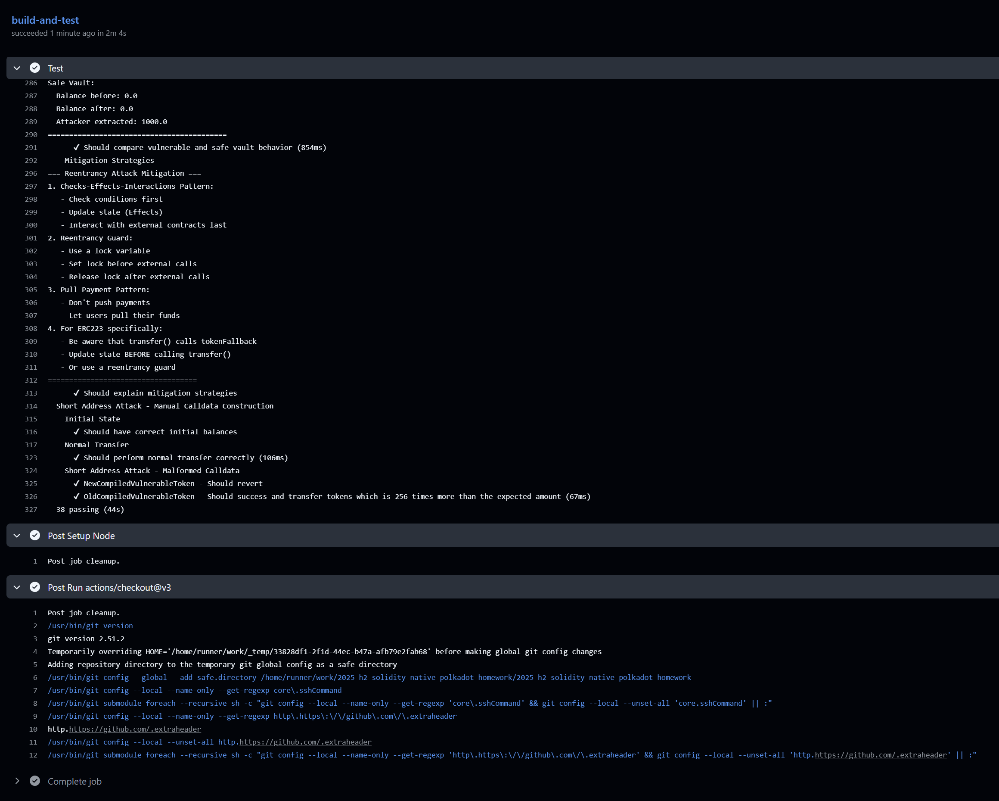

## Attack Demos Overview

本工程实现了多种典型智能合约攻击场景，并为每种攻击编写了对应的 Hardhat测试用例.

---

### 1. Short Address Attack（短地址攻击）

- **攻击原理**
  - 早期 EVM / 钱包在编码参数时，如果收款地址不是 20 字节（如少了 1 字节），会在末尾自动补 0。
  - 这样会导致紧随其后的 `amount` 参数整体左移 1 字节，相当于被乘以 256。
  - 攻击者构造一个以 `0x00` 结尾的短地址，引导受害者向该地址转账一个较小金额，实际转出的却是 256 倍。
- **防护原理**
  - 在合约层面检查地址格式（例如拒绝以 `0x00` 结尾的地址）。
  - 在应用层/钱包层严格检查地址长度，禁止短地址输入（现代钱包基本已修复）。
  - 此漏洞在新版本编译器中已经无效，新版本会对所有的参数进行32位对齐。

- **相关合约与测试**
  - 合约：`ShortAddressAttackNewCompiler.sol` / `ShortAddressAttackOldCompiler.sol`
  - 测试：`test/ShortAddressAttack.ts`

---

### 2. Denial of Service（DoS / 拒绝服务）

- **攻击原理**
  - 合约在 `distributeRewards` 中对所有用户做无界循环，如果注册用户过多，会导致 gas 消耗过大，交易无法打包或频繁回滚。
  - 攻击者通过批量注册大量“僵尸账户”，让奖励分发函数无法在单个区块内执行完毕，从而实质上拒绝服务。
- **防护原理**
  - 避免在单笔交易中对 unbounded list 做完整遍历，使用分页、拉取式领取（pull payment）、或 off-chain batch 方案。
  - 引入上限、清退机制或按需清算。
- **相关合约与测试**
  - 合约：`DenialOfService.sol`（`VulnerableRewardDistributor` / `DoSAttacker` / `DoSAttackerFactory`）
  - 测试：`test/DenialOfService.ts`

---

### 3. DS-Auth + ERC223 ATN Attack（授权逻辑滥用攻击）

- **攻击原理**
  - ATN合约在`transferFrom`函数支持超级回调，对外部调用不作查检。攻击者让ATN合约调用自己的`SetOwner`函数，这个函数本身需要`Owner`或者`ATN`合约自己才能调用。这个函数的回调能让第三方绕过这个检查。
- **防护原理**
  - 对于外部调用一定要小心和限制。
- **相关合约与测试**
  - 合约：`ATNAttack.sol`、`VulnERC223Token.sol` 中的 DS-Auth 变体
  - 测试：`test/DSAuthATN.ts`

---

### 4. Reentrancy on ERC223 Transfer（重入攻击）

- **攻击原理**
  - ERC223 的 `transfer` 会在向合约地址转账时调用接收方合约的 `tokenFallback`。
  - 在 `VulnerableVault.withdraw` 中先调用 `token.transfer(msg.sender, amount, "")`，再更新 `deposits` 和 `totalDeposits`。
  - 攻击合约在其 `tokenFallback` 中再次调用 `withdraw`，因为状态尚未更新，仍然满足 `deposits[msg.sender] >= amount`，从而可以多次重复提取，直到保险库余额耗尽。
- **防护原理**
  - 使用 Checks-Effects-Interactions 模式：**先检查 + 更新状态，再外部调用**。
  - 使用重入锁（`ReentrancyGuard` 模式）阻止嵌套调用。
  - 将主动转账改为“用户主动提取”（pull payment），避免在外部调用中持有状态不一致。
  - 新版本Solidity已经加入了上下溢，可以一定程序上防护这个漏洞。
- **相关合约与测试**
  - 合约：`ReentrancyAttack.sol`（`VulnerableVault` / `SafeVault` / `ReentrancyAttacker`）
  - 测试：`test/ReentrancyAttack.ts`

---

### 5. Delegatecall Attack（存储劫持攻击）

- **攻击原理**
  - `VulnerableDelegateCaller` 在 `fallback()` 中对外部逻辑合约 `logic` 执行：
    - `impl.delegatecall(msg.data);`
  - `DelegateLogic` 合约实现了无权限检查的 `setOwner(address)` / `setValue(uint256)`，且其存储布局与 `VulnerableDelegateCaller` 对齐（`owner`, `someValue`）。
  - 攻击者构造 `DelegateLogic.setOwner(attacker)` 的调用数据直发给 `VulnerableDelegateCaller`：
    - 因为主合约没有该函数，会进入 `fallback`。
    - `delegatecall` 在主合约的存储上下文中执行 `setOwner(attacker)`。
    - 最终写入的是 `VulnerableDelegateCaller.owner`，攻击者取得所有权。
- **防护原理**
  - 禁止在 `fallback` 中直接对任意 `msg.data` 做裸 `delegatecall`。
  - 使用受限的函数选择器白名单，或采用严格的代理模式（如 EIP-1967 / UUPS 模式）并结合访问控制。
  - 确保逻辑合约中的敏感函数有完备的权限控制。
- **相关合约与测试**
  - 合约：`DelegatecallAttack.sol`（`DelegateLogic` / `VulnerableDelegateCaller`）
  - 测试：`test/DelegatecallAttack.ts`

